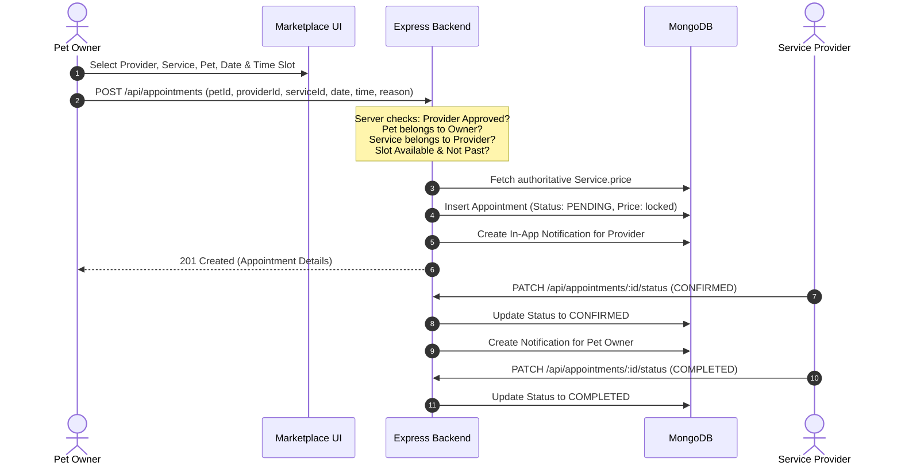
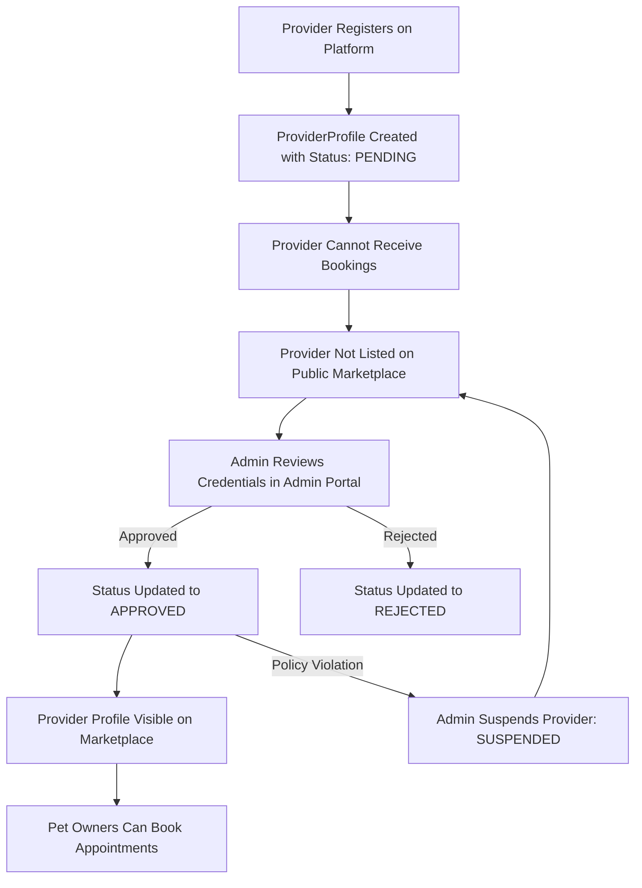

# PetCare - Full-Stack Pet Care Management & Service Booking Platform

[](LICENSE)
[](https://nodejs.org/)
[](https://expressjs.com/)
[](https://react.dev/)
[](https://vitejs.dev/)
[](https://tailwindcss.com/)
[](https://www.mongodb.com/)

A modern, full-fledged **PetCare Service Marketplace and Management Web Application** that seamlessly connects pet owners with certified pet-care professionals—including **Veterinarians**, **Pet Groomers**, and **Pet Trainers**.

The platform features role-based access control, pet health records management, real-time availability and conflict-free appointment booking, dedicated provider management dashboards, administrative compliance controls, and real-time in-app notifications.

---

## 📑 Table of Contents

- [System Overview](#-system-overview)
- [Key Features](#-key-features)
- [Architecture & Tech Stack](#-architecture--tech-stack)
- [Project Structure](#-project-structure)
- [User Roles & Permissions](#-user-roles--permissions)
- [Core Application Flows](#-core-application-flows)
- [Demo Credentials](#-demo-credentials)
- [Quick Start Guide](#-quick-start-guide)
- [Documentation Index](#-documentation-index)
- [API Overview](#-api-overview)
- [Security & Business Rules](#-security--business-rules)
- [Development Roadmap](#-development-roadmap)

---

## 🌟 System Overview

PetCare solves the fragmented experience pet parents face when seeking trusted medical, grooming, and behavioral training services. By providing a unified marketplace alongside private clinical and pet profile records, PetCare ensures:

1. **Vetted Service Providers**: Only admin-approved service providers can list services and accept appointments.
2. **Deterministic Scheduling**: Collision-free booking algorithm prevents double bookings, invalid time slots, and past dates.
3. **Financial & Price Integrity**: Appointment costs are strictly locked and resolved server-side from the provider's active catalog.
4. **Pet Medical Portfolio**: Owners maintain comprehensive records for multiple pets (species, breed, age, weight, vaccination status, medical notes).
5. **Role-Driven Dashboards**: Specialized portals for Pet Owners, Service Providers, and System Administrators.

---

## ✨ Key Features

### 🐾 For Pet Owners
- **Pet Management (CRUD)**: Create, view, edit, and manage profiles for dogs, cats, birds, rabbits, and other pets.
- **Service Marketplace**: Explore verified veterinarians, groomers, and trainers with search, location filtering, and category selection.
- **Detailed Provider Profiles**: View qualifications, years of experience, service catalogs, transparent pricing, and client ratings.
- **Collision-Free Booking**: Multi-step booking wizard (Provider &rarr; Service &rarr; Pet &rarr; Date &rarr; Slot &rarr; Reason).
- **Appointment Management**: Track appointments categorized by status: `Upcoming`, `Completed`, and `Cancelled`.
- **In-App Notifications**: Real-time alerts for appointment confirmations, cancellations, and status updates.

### 🩺 For Service Providers (Vets, Groomers, Trainers)
- **Professional Onboarding**: Select specialization, upload credentials, define location, and write professional bios.
- **Service Catalog Management**: Add, update, toggle, or delete services with customizable durations, descriptions, and pricing.
- **Provider Dashboard**: High-level metrics tracking total, pending, upcoming, and completed appointments.
- **Appointment Lifecycle Operations**: Accept pending bookings, reject invalid requests, or mark completed sessions.
- **Notification Center**: Instant alerts when pet owners submit new bookings or cancel appointments.

### 🛡️ For Platform Administrators
- **Executive Dashboard**: Real-time platform counts for Users, Pet Owners, Providers (Pending & Approved), Pets, and Appointments.
- **Provider Verification Queue**: Review credential submissions, approve qualified providers for public listing, reject, or suspend accounts.
- **User Governance**: Toggle active/inactive status across all platform users.
- **Platform-Wide Audit**: View and filter all appointments across all providers and owners.

---

## 🛠️ Architecture & Tech Stack

PetCare is built on a clean, modular Client-Server 3-Tier Architecture.

```text
┌─────────────────────────────────────────────────────────────┐
│                    React.js Frontend (Vite)                 │
│    Tailwind CSS • React Router v6 • Axios • Context API     │
└──────────────────────────────┬──────────────────────────────┘
                               │  RESTful JSON API (JWT Auth)
                               ▼
┌─────────────────────────────────────────────────────────────┐
│                   Node.js & Express Backend                 │
│ Controllers • RBAC Middleware • Services • Mongoose Models  │
└──────────────────────────────┬──────────────────────────────┘
                               │  Mongoose ODM
                               ▼
┌─────────────────────────────────────────────────────────────┐
│                     MongoDB Database                        │
│   Users • Pets • ProviderProfiles • Services • Appointments │
└─────────────────────────────────────────────────────────────┘
```

| Layer | Technologies | Role & Purpose |
| :--- | :--- | :--- |
| **Frontend** | React 18, Vite, JavaScript | Single Page Application (SPA), lightning-fast HMR |
| **Styling** | Tailwind CSS | Modern, responsive, mobile-first design system |
| **Routing** | React Router DOM v6 | Declarative routing with authenticated and role-based guards |
| **State & API** | React Context API, Axios | Global user auth state, centralized HTTP client with interceptors |
| **Backend** | Node.js, Express.js | Modular REST API server, routing, and controller architecture |
| **Database** | MongoDB, Mongoose ODM | Document-based persistence, relational references, schema validation |
| **Authentication** | JWT (JSON Web Tokens), bcryptjs | Stateless token auth, one-way cryptographic password hashing |
| **Security** | Express Rate Limit, Helmet, CORS | Defense-in-depth protection against common web vulnerabilities |

---

## 📁 Project Structure

```text
petcare-platform/
├── client/                          # React + Vite Frontend
│   ├── public/                      # Static assets & favicons
│   ├── src/
│   │   ├── components/              # Reusable UI components
│   │   │   ├── common/              # Navbar, Footer, Buttons, Modals, Badges
│   │   │   ├── cards/               # ProviderCard, ServiceCard, PetCard, StatCard
│   │   │   └── forms/               # Input fields, select dropdowns, search bars
│   │   ├── context/                 # AuthContext, NotificationContext
│   │   ├── hooks/                   # useAuth, useNotifications, useFetch
│   │   ├── layouts/                 # MainLayout, DashboardLayout, AdminLayout
│   │   ├── pages/                   # Application views
│   │   │   ├── public/              # Home, About, Services, Marketplace, ProviderProfile
│   │   │   ├── auth/                # Login, Register (Owner & Provider)
│   │   │   ├── owner/               # OwnerDashboard, MyPets, MyAppointments, PetForm
│   │   │   ├── provider/            # ProviderDashboard, ServiceManager, ProviderAppointments
│   │   │   └── admin/               # AdminDashboard, UserManagement, ProviderApproval, AppointmentsAdmin
│   │   ├── services/                # Axios API modules (api.js, authService, petService, etc.)
│   │   ├── utils/                   # Formatters, date helpers, validation rules
│   │   ├── App.jsx                  # Route definitions & Guard wrappers
│   │   ├── index.css                # Tailwind directives & custom classes
│   │   └── main.jsx                 # React root DOM entrypoint
│   ├── index.html                   # HTML5 template
│   ├── package.json
│   ├── tailwind.config.js
│   └── vite.config.js
│
├── server/                          # Node.js + Express Backend
│   ├── config/                      # Database & environment configurations (db.js)
│   ├── controllers/                 # Request handlers & response formatters
│   │   ├── authController.js
│   │   ├── petController.js
│   │   ├── providerController.js
│   │   ├── serviceController.js
│   │   ├── appointmentController.js
│   │   ├── notificationController.js
│   │   └── adminController.js
│   ├── middleware/                  # Security, auth, and role verification
│   │   ├── authMiddleware.js        # JWT token extraction & verification
│   │   ├── roleMiddleware.js        # RBAC role guards (Owner, Provider, Admin)
│   │   ├── errorMiddleware.js       # Global centralized error handler
│   │   └── validationMiddleware.js  # Request body validation
│   ├── models/                      # Mongoose data schemas
│   │   ├── User.js
│   │   ├── Pet.js
│   │   ├── ProviderProfile.js
│   │   ├── Service.js
│   │   ├── Appointment.js
│   │   └── Notification.js
│   ├── routes/                      # REST endpoint route declarations
│   │   ├── authRoutes.js
│   │   ├── petRoutes.js
│   │   ├── providerRoutes.js
│   │   ├── serviceRoutes.js
│   │   ├── appointmentRoutes.js
│   │   ├── notificationRoutes.js
│   │   └── adminRoutes.js
│   ├── seed/                        # Comprehensive mock data & auto-seeder
│   │   ├── seedData.js
│   │   └── seeder.js
│   ├── utils/                       # Token helpers, response wrappers, date checks
│   ├── .env.example
│   ├── package.json
│   └── server.js                    # Express app initialization & server entry
│
└── docs/                            # Comprehensive Project Specifications
    ├── PROJECT_SPECIFICATION.md
    ├── SYSTEM_ARCHITECTURE.md
    ├── DATABASE_SCHEMA.md
    ├── API_DOCUMENTATION.md
    ├── APPOINTMENT_WORKFLOW_AND_RULES.md
    ├── UI_UX_DESIGN_GUIDELINES.md
    ├── SEED_DATA_AND_DEMO_GUIDE.md
    └── IMPLEMENTATION_ROADMAP.md
```

---

## 👥 User Roles & Permissions

The system operates with three top-level roles and three provider specialization categories:

```text
                      ┌──────────────────────┐
                      │      User Roles      │
                      └──────────┬───────────┘
         ┌───────────────────────┼───────────────────────┐
         ▼                       ▼                       ▼
  ┌──────────────┐      ┌─────────────────┐      ┌──────────────┐
  │  PET_OWNER   │      │SERVICE_PROVIDER │      │    ADMIN     │
  └──────────────┘      └────────┬────────┘      └──────────────┘
                                 │
              ┌──────────────────┼──────────────────┐
              ▼                  ▼                  ▼
      ┌───────────────┐  ┌───────────────┐  ┌───────────────┐
      │ VETERINARIAN  │  │  PET_GROOMER  │  │  PET_TRAINER  │
      └───────────────┘  └───────────────┘  └───────────────┘
```

| Action / Capability | PET_OWNER | SERVICE_PROVIDER | ADMIN |
| :--- | :---: | :---: | :---: |
| Register and log in | ✅ | ✅ | *(Pre-seeded)* |
| Manage personal pet profiles (CRUD) | ✅ | ❌ | View Only |
| Browse approved public marketplace | ✅ | ✅ | ✅ |
| Manage professional profile & bio | ❌ | ✅ | View & Status Edit |
| Create, edit, and delete services | ❌ | ✅ | View Only |
| Book appointments | ✅ | ❌ | ❌ |
| Accept / Reject / Complete bookings | ❌ | ✅ | ❌ |
| Cancel own pending/confirmed booking | ✅ | ❌ | ✅ |
| Approve / Reject / Suspend providers | ❌ | ❌ | ✅ |
| Enable / Disable user accounts | ❌ | ❌ | ✅ |
| Access executive analytics dashboard | ❌ | ❌ | ✅ |

---

## 🔄 Core Application Flows

### 1. End-to-End Service Booking Flow



### 2. Provider Approval & Marketplace Listing Flow



---

## 🔑 Demo Credentials

The platform includes seed data ready for immediate demonstration:

| Role | Name | Email | Password | Status / Specialization |
| :--- | :--- | :--- | :--- | :--- |
| **ADMIN** | System Administrator | `admin@petcare.com` | `Admin@123` | Master Admin |
| **PET OWNER** | Sarah Jenkins | `sarah@example.com` | `Owner@123` | Active (Has 2 Pets) |
| **PET OWNER** | Michael Chang | `michael@example.com` | `Owner@123` | Active (Has 1 Pet) |
| **VETERINARIAN** | Dr. Rahul Sharma | `dr.sharma@petcare.com` | `Provider@123` | **Approved** (Nagpur) |
| **VETERINARIAN** | Dr. Emily Watson | `dr.watson@petcare.com` | `Provider@123` | **Pending** (New Registration) |
| **PET GROOMER** | Oliver Twist Grooming | `oliver@petcare.com` | `Provider@123` | **Approved** (Mumbai) |
| **PET GROOMER** | Chloe Fluff Care | `chloe@petcare.com` | `Provider@123` | **Approved** (Pune) |
| **PET TRAINER** | Alex Canine Academy | `alex@petcare.com` | `Provider@123` | **Approved** (Bangalore) |
| **PET TRAINER** | David Paws Training | `david@petcare.com` | `Provider@123` | **Suspended** (Audit Hold) |

---

## 🚀 Quick Start Guide

### Prerequisites
- [Node.js](https://nodejs.org/) (v18.x or v20.x recommended)
- [MongoDB](https://www.mongodb.com/) (Local community edition or MongoDB Atlas URI)
- Git & npm

### 1. Clone the Repository
```bash
git clone https://github.com/SanvedSahu/Pet_Care.git
cd Pet_Care
```

### 2. Backend Setup
```bash
# Navigate to backend directory
cd server

# Install dependencies
npm install

# Create environment configuration
cp .env.example .env
# Edit .env to set your MONGO_URI and JWT_SECRET

# Seed database with sample users, providers, services, and appointments
npm run seed

# Start development server
npm run dev
```
Backend runs on `http://localhost:5000`.

### 3. Frontend Setup
```bash
# Navigate to frontend directory
cd ../client

# Install dependencies
npm install

# Start Vite development server
npm run dev
```
Frontend runs on `http://localhost:5173`.

---

## 📚 Documentation Index

Detailed architectural and engineering documentation is provided in the [`docs/`](./docs) folder:

1. [**Project Specification**](./docs/PROJECT_SPECIFICATION.md): Functional and non-functional requirements, user stories, role matrices, and boundaries.
2. [**System Architecture**](./docs/SYSTEM_ARCHITECTURE.md): Component diagrams, directory layouts, middleware pipelines, and state management.
3. [**Database Schema**](./docs/DATABASE_SCHEMA.md): Complete Mongoose schemas, ERD, indexes, field types, enums, and data rules.
4. [**API Documentation**](./docs/API_DOCUMENTATION.md): Complete REST endpoint specifications, request/response payloads, and status codes.
5. [**Appointment Workflow & Rules**](./docs/APPOINTMENT_WORKFLOW_AND_RULES.md): Booking state machine, collision avoidance logic, and price integrity.
6. [**UI/UX Design Guidelines**](./docs/UI_UX_DESIGN_GUIDELINES.md): Visual tokens, Tailwind color palette, badges, responsive rules, and wireframes.
7. [**Seed Data & Demo Guide**](./docs/SEED_DATA_AND_DEMO_GUIDE.md): Seed account details, sample catalog, and a 22-step live demo walkthrough script.
8. [**Implementation Roadmap**](./docs/IMPLEMENTATION_ROADMAP.md): Phase-by-phase implementation plan and verification checkpoints.

---

## 📡 API Overview

All API endpoints return a consistent JSON response:
```json
{
  "success": true,
  "message": "Operation successful",
  "data": {}
}
```

### Route Summary

| Module | Method & Route | Access Level | Description |
| :--- | :--- | :--- | :--- |
| **Auth** | `POST /api/auth/register` | Public | Register Pet Owner or Service Provider |
| **Auth** | `POST /api/auth/login` | Public | Authenticate user & issue JWT |
| **Auth** | `GET /api/auth/me` | Authenticated | Retrieve current user profile |
| **Pets** | `GET /api/pets` | PET_OWNER | List pets owned by logged-in user |
| **Pets** | `POST /api/pets` | PET_OWNER | Add a new pet |
| **Pets** | `PUT /api/pets/:id` | PET_OWNER | Update pet information |
| **Providers** | `GET /api/providers` | Public | Search & filter approved providers |
| **Providers** | `GET /api/providers/:id` | Public | View public provider profile & services |
| **Services** | `POST /api/services` | SERVICE_PROVIDER | Add service to catalog |
| **Services** | `PUT /api/services/:id` | SERVICE_PROVIDER | Update existing service |
| **Appointments**| `POST /api/appointments` | PET_OWNER | Book appointment (server checks price & slots) |
| **Appointments**| `GET /api/appointments/my` | PET_OWNER | View owner's appointment history |
| **Appointments**| `GET /api/appointments/provider`| SERVICE_PROVIDER | View provider's assigned bookings |
| **Appointments**| `PATCH /api/appointments/:id/status`| Provider / Owner | Update status (Confirm/Reject/Complete/Cancel) |
| **Admin** | `GET /api/admin/dashboard` | ADMIN | Platform counts & executive stats |
| **Admin** | `PATCH /api/admin/providers/:id/approve` | ADMIN | Approve provider for public listing |
| **Admin** | `PATCH /api/admin/users/:id/status` | ADMIN | Toggle user active status |

*(For full endpoint documentation with sample request/response bodies, see [`docs/API_DOCUMENTATION.md`](./docs/API_DOCUMENTATION.md))*

---

## 🔒 Security & Business Rules

1. **Server-Side Price Validation**: Frontend appointment requests submit only `serviceId`. The backend queries the database for the authoritative price. Client-submitted prices are ignored.
2. **Double-Booking Prevention**: An appointment cannot be booked if an existing confirmed or pending appointment overlaps on the requested provider, date, and time slot.
3. **Past Date Rejection**: Appointments cannot be scheduled in the past.
4. **Ownership Verification**:
   - Pet owners can only book using pets linked to their user ID.
   - Service providers can only edit or delete services belonging to them.
   - Providers can only access appointments directed to them.
5. **Approval Enforcement**: Providers with `PENDING`, `REJECTED`, or `SUSPENDED` status cannot appear on the public marketplace and cannot receive appointment requests.
6. **No Plaintext Passwords**: Passwords are encrypted using `bcryptjs` with salt factor 10.
7. **Strict Scope Control**: No online payment gateways, SMS integrations, or video chat dependencies are implemented to ensure architectural focus and clean demonstration.

---

## 🗺️ Development Roadmap

- [x] **Phase 1: Project Architecture & Specification Documentation**
- [ ] **Phase 2: Backend Infrastructure & MongoDB Schemas**
- [ ] **Phase 3: JWT Authentication & RBAC Middleware Pipeline**
- [ ] **Phase 4: Core REST API Implementation & Validation**
- [ ] **Phase 5: Automated Database Seeder & Mock Data**
- [ ] **Phase 6: Frontend Scaffolding, Tailwind Design System & Shell**
- [ ] **Phase 7: Public Marketplace & Provider Discovery UI**
- [ ] **Phase 8: Pet Owner Experience (Pet Management & Booking Wizard)**
- [ ] **Phase 9: Service Provider Dashboard & Appointment Actions**
- [ ] **Phase 10: Admin Management Control Center**
- [ ] **Phase 11: End-to-End Testing & Demonstration Verification**

---

## 📄 License

This project is licensed under the MIT License. See the [LICENSE](LICENSE) file for details.
