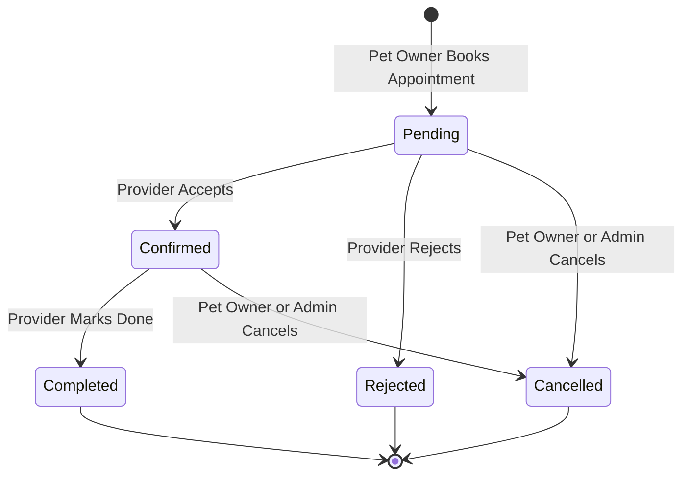

# PetCare - Appointment Workflow & Business Rules

This document specifies the business logic, validation rules, collision avoidance mechanisms, and state transition lifecycle governing the **Appointment Booking Engine**.

---

## 1. Appointment State Machine

Appointments transition through a strict, deterministic finite state machine (FSM):



### State Definitions & Characteristics

| Status | Meaning | Can Transition To | Who Can Trigger Transition? |
| :--- | :--- | :--- | :--- |
| **`Pending`** | Initial booking submitted by pet owner; awaiting provider review. | `Confirmed`, `Rejected`, `Cancelled` | Provider (Confirm/Reject), Owner (Cancel), Admin (Cancel) |
| **`Confirmed`** | Provider accepted the appointment; time slot is officially locked. | `Completed`, `Cancelled` | Provider (Complete), Owner (Cancel), Admin (Cancel) |
| **`Completed`** | Service has been performed and concluded. | *None (Terminal)* | Provider, Admin |
| **`Rejected`** | Provider declined the booking request. | *None (Terminal)* | Provider |
| **`Cancelled`** | Booking was aborted prior to service completion. | *None (Terminal)* | Pet Owner, Admin |

> [!IMPORTANT]
> Once an appointment reaches a terminal state (`Completed`, `Rejected`, or `Cancelled`), its status is immutable and cannot be reopened.

---

## 2. Pre-Booking Validation Checklist

When `POST /api/appointments` is invoked, the backend executes the following six validation gates in sequence:

```text
Incoming Booking Request (providerId, serviceId, petId, date, time)
    │
    ▼
[Gate 1: Provider Status Check] ─── Provider is 'Approved'? ──────► (No: 400 Bad Request)
    │ Yes
    ▼
[Gate 2: Pet Ownership Check] ──── Pet.owner === req.user._id? ───► (No: 403 Forbidden)
    │ Yes
    ▼
[Gate 3: Service-Provider Link] ── Service.provider === provider? ─► (No: 400 Bad Request)
    │ Yes
    ▼
[Gate 4: Chronological Check] ──── Date/Time is in future? ───────► (No: 400 Bad Request)
    │ Yes
    ▼
[Gate 5: Collision Avoidance] ──── Overlapping active booking? ───► (Yes: 409 Conflict)
    │ No
    ▼
[Gate 6: Authoritative Pricing] ── Price = Service.price (DB)
    │
    ▼
Save Appointment to MongoDB (Status: 'Pending')
Trigger In-App Notification to Provider
```

### Gate 1: Provider Verification
```javascript
const provider = await ProviderProfile.findById(providerId);
if (!provider || provider.approvalStatus !== 'Approved') {
  return res.status(400).json({
    success: false,
    message: 'Appointments can only be booked with verified and approved providers.'
  });
}
```

### Gate 2: Pet Ownership Verification
```javascript
const pet = await Pet.findById(petId);
if (!pet || pet.owner.toString() !== req.user._id.toString()) {
  return res.status(403).json({
    success: false,
    message: 'Unauthorized. You can only schedule appointments for your own pets.'
  });
}
```

### Gate 3: Service-Provider Association Check
```javascript
const service = await Service.findById(serviceId);
if (!service || service.provider.toString() !== provider._id.toString() || !service.isActive) {
  return res.status(400).json({
    success: false,
    message: 'The requested service is not offered or currently inactive.'
  });
}
```

### Gate 4: Past Date / Time Prevention
```javascript
const appointmentDateTime = new Date(`${date} ${time}`);
if (appointmentDateTime <= new Date()) {
  return res.status(400).json({
    success: false,
    message: 'Appointment date and time must be in the future.'
  });
}
```

### Gate 5: Double-Booking / Collision Avoidance
```javascript
const existingBooking = await Appointment.findOne({
  provider: provider._id,
  date: new Date(date),
  time: time,
  status: { $in: ['Pending', 'Confirmed'] }
});

if (existingBooking) {
  return res.status(409).json({
    success: false,
    message: 'This time slot is already reserved. Please select another slot.'
  });
}
```

### Gate 6: Server-Enforced Authoritative Price Locking
```javascript
// NEVER trust a price sent from the client!
const appointment = new Appointment({
  petOwner: req.user._id,
  pet: pet._id,
  provider: provider._id,
  service: service._id,
  date: new Date(date),
  time: time,
  reason: reason || 'Routine appointment',
  price: service.price, // Directly extracted from database
  status: 'Pending'
});
```

---

## 3. Standard Time Slot Grid

Service providers operate on a deterministic, standard working-hours grid:

| Time Slot Index | Time String | Period |
| :---: | :---: | :---: |
| 1 | `09:00 AM` | Morning |
| 2 | `09:45 AM` | Morning |
| 3 | `10:30 AM` | Morning |
| 4 | `11:15 AM` | Morning |
| 5 | `12:00 PM` | Afternoon |
| 6 | `01:30 PM` | Afternoon |
| 7 | `02:15 PM` | Afternoon |
| 8 | `03:00 PM` | Afternoon |
| 9 | `03:45 PM` | Evening |
| 10 | `04:30 PM` | Evening |
| 11 | `05:15 PM` | Evening |

When a pet owner selects a date on the client booking wizard:
1. The client queries `/api/appointments/provider?providerId=...&date=...`.
2. Any slot with status `Pending` or `Confirmed` is marked as **Disabled / Booked**.
3. Past slots for today's date are disabled automatically.

---

## 4. Notification Triggers on Status Transitions

Whenever an appointment status changes, the server generates an in-app notification:

| Event | Recipient | Notification Message |
| :--- | :--- | :--- |
| **New Booking (`Pending`)** | Service Provider | `"New appointment request from Sarah Jenkins for Max on Oct 15, 10:30 AM."` |
| **Booking Confirmed (`Confirmed`)** | Pet Owner | `"Dr. Rahul Sharma has confirmed your appointment for Max on Oct 15, 10:30 AM."` |
| **Booking Rejected (`Rejected`)** | Pet Owner | `"Dr. Rahul Sharma was unable to accept your appointment for Oct 15. Please choose another slot."` |
| **Booking Cancelled (`Cancelled`)** | Service Provider | `"Sarah Jenkins has cancelled the appointment for Max on Oct 15, 10:30 AM."` |
| **Booking Completed (`Completed`)** | Pet Owner | `"Your appointment for Max with Dr. Rahul Sharma has been marked as Completed. Thank you!"` |
