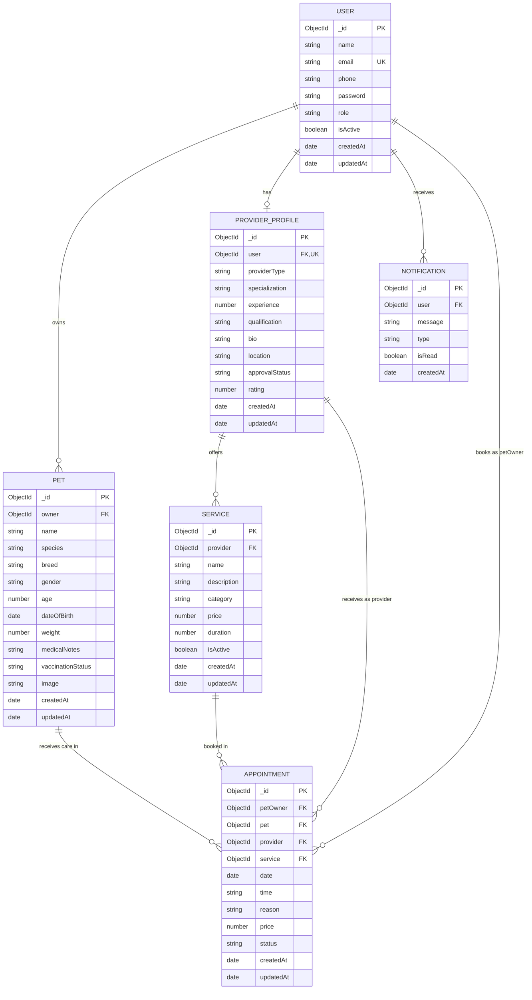

# PetCare - Database Schema & Data Models

This document details the MongoDB data schemas, field types, validations, relationships, and indexing strategies implemented using **Mongoose ODM**.

---

## 1. Entity-Relationship Diagram (ERD)



---

## 2. Model Specifications

### 2.1 User Model (`User.js`)

Represents all registered individuals on the platform (Pet Owners, Service Providers, and Administrators).

```javascript
const userSchema = new mongoose.Schema({
  name: {
    type: String,
    required: [true, 'Name is required'],
    trim: true,
    minlength: [2, 'Name must be at least 2 characters long'],
    maxlength: [60, 'Name cannot exceed 60 characters']
  },
  email: {
    type: String,
    required: [true, 'Email is required'],
    unique: true,
    lowercase: true,
    trim: true,
    match: [/^\S+@\S+\.\S+$/, 'Please provide a valid email address']
  },
  phone: {
    type: String,
    required: [true, 'Phone number is required'],
    trim: true
  },
  password: {
    type: String,
    required: [true, 'Password is required'],
    minlength: [6, 'Password must be at least 6 characters long'],
    select: false // Never returned in default queries
  },
  role: {
    type: String,
    enum: {
      values: ['PET_OWNER', 'SERVICE_PROVIDER', 'ADMIN'],
      message: '{VALUE} is not a supported user role'
    },
    default: 'PET_OWNER'
  },
  isActive: {
    type: Boolean,
    default: true
  }
}, {
  timestamps: true
});
```

#### Indexes:
- `{ email: 1 }` (Unique)
- `{ role: 1 }`

---

### 2.2 Pet Model (`Pet.js`)

Stores profiles of animals belonging to a specific pet owner.

```javascript
const petSchema = new mongoose.Schema({
  owner: {
    type: mongoose.Schema.Types.ObjectId,
    ref: 'User',
    required: [true, 'Pet must be associated with an owner']
  },
  name: {
    type: String,
    required: [true, 'Pet name is required'],
    trim: true,
    maxlength: [40, 'Pet name cannot exceed 40 characters']
  },
  species: {
    type: String,
    required: [true, 'Species is required'],
    enum: {
      values: ['Dog', 'Cat', 'Bird', 'Rabbit', 'Other'],
      message: '{VALUE} is not a supported species'
    }
  },
  breed: {
    type: String,
    trim: true,
    default: 'Mixed / Unknown'
  },
  gender: {
    type: String,
    enum: ['Male', 'Female', 'Unknown'],
    default: 'Unknown'
  },
  age: {
    type: Number,
    required: [true, 'Age in years is required'],
    min: [0, 'Age cannot be negative'],
    max: [40, 'Age exceeds standard life expectancy']
  },
  dateOfBirth: {
    type: Date
  },
  weight: {
    type: Number,
    min: [0, 'Weight must be a positive number'],
    required: [true, 'Weight in kg is required']
  },
  medicalNotes: {
    type: String,
    trim: true,
    default: 'No known pre-existing medical conditions.'
  },
  vaccinationStatus: {
    type: String,
    enum: ['Up to Date', 'Partially Vaccinated', 'Not Vaccinated', 'Unknown'],
    default: 'Up to Date'
  },
  image: {
    type: String,
    default: 'https://images.unsplash.com/photo-1543466835-00a7907e9de1?auto=format&fit=crop&w=400&q=80'
  }
}, {
  timestamps: true
});
```

#### Indexes:
- `{ owner: 1 }`
- `{ species: 1 }`

---

### 2.3 ProviderProfile Model (`ProviderProfile.js`)

Contains professional credentials, bio, approval status, and practice location for users with role `SERVICE_PROVIDER`.

```javascript
const providerProfileSchema = new mongoose.Schema({
  user: {
    type: mongoose.Schema.Types.ObjectId,
    ref: 'User',
    required: true,
    unique: true
  },
  providerType: {
    type: String,
    required: [true, 'Provider type is required'],
    enum: {
      values: ['Veterinarian', 'Pet Groomer', 'Pet Trainer'],
      message: '{VALUE} is not an authorized provider type'
    }
  },
  specialization: {
    type: String,
    required: [true, 'Specialization is required'],
    trim: true
  },
  experience: {
    type: Number,
    required: [true, 'Years of experience is required'],
    min: [0, 'Experience cannot be negative']
  },
  qualification: {
    type: String,
    required: [true, 'Qualification / License is required'],
    trim: true
  },
  bio: {
    type: String,
    trim: true,
    maxlength: [1000, 'Bio cannot exceed 1000 characters']
  },
  location: {
    type: String,
    required: [true, 'Location / City is required'],
    trim: true
  },
  approvalStatus: {
    type: String,
    enum: ['Pending', 'Approved', 'Rejected', 'Suspended'],
    default: 'Pending'
  },
  rating: {
    type: Number,
    default: 4.8,
    min: 1.0,
    max: 5.0
  }
}, {
  timestamps: true
});
```

#### Indexes:
- `{ user: 1 }` (Unique)
- `{ approvalStatus: 1, providerType: 1 }` (Compound index for public marketplace queries)
- `{ location: 1 }`

---

### 2.4 Service Model (`Service.js`)

Represents bookable clinical, grooming, or training offerings created by an individual provider.

```javascript
const serviceSchema = new mongoose.Schema({
  provider: {
    type: mongoose.Schema.Types.ObjectId,
    ref: 'ProviderProfile',
    required: [true, 'Service must be linked to a provider profile']
  },
  name: {
    type: String,
    required: [true, 'Service name is required'],
    trim: true,
    maxlength: [80, 'Service name cannot exceed 80 characters']
  },
  description: {
    type: String,
    required: [true, 'Description is required'],
    trim: true,
    maxlength: [400, 'Description cannot exceed 400 characters']
  },
  category: {
    type: String,
    enum: ['Veterinary', 'Grooming', 'Training', 'General'],
    default: 'General'
  },
  price: {
    type: Number,
    required: [true, 'Service price is required'],
    min: [0, 'Price must be 0 or positive']
  },
  duration: {
    type: Number,
    required: [true, 'Duration in minutes is required'],
    min: [10, 'Duration must be at least 10 minutes'],
    max: [240, 'Duration cannot exceed 240 minutes']
  },
  isActive: {
    type: Boolean,
    default: true
  }
}, {
  timestamps: true
});
```

#### Indexes:
- `{ provider: 1 }`
- `{ category: 1 }`

---

### 2.5 Appointment Model (`Appointment.js`)

Stores scheduled service sessions between a pet owner, pet, and service provider.

```javascript
const appointmentSchema = new mongoose.Schema({
  petOwner: {
    type: mongoose.Schema.Types.ObjectId,
    ref: 'User',
    required: [true, 'Appointment must reference a pet owner']
  },
  pet: {
    type: mongoose.Schema.Types.ObjectId,
    ref: 'Pet',
    required: [true, 'Appointment must reference a pet']
  },
  provider: {
    type: mongoose.Schema.Types.ObjectId,
    ref: 'ProviderProfile',
    required: [true, 'Appointment must reference a provider profile']
  },
  service: {
    type: mongoose.Schema.Types.ObjectId,
    ref: 'Service',
    required: [true, 'Appointment must reference a service']
  },
  date: {
    type: Date,
    required: [true, 'Appointment date is required']
  },
  time: {
    type: String,
    required: [true, 'Appointment time slot is required'],
    trim: true // Format: "10:00 AM", "02:30 PM"
  },
  reason: {
    type: String,
    trim: true,
    maxlength: [500, 'Reason cannot exceed 500 characters'],
    default: 'Routine consultation / appointment'
  },
  price: {
    type: Number,
    required: true,
    min: 0 // Locked from authoritative Service.price upon creation
  },
  status: {
    type: String,
    enum: ['Pending', 'Confirmed', 'Completed', 'Cancelled', 'Rejected'],
    default: 'Pending'
  }
}, {
  timestamps: true
});
```

#### Indexes:
- `{ provider: 1, date: 1, time: 1 }` (Compound collision check index)
- `{ petOwner: 1, status: 1 }` (Optimizes owner appointment lists)
- `{ provider: 1, status: 1 }` (Optimizes provider appointment lists)

---

### 2.6 Notification Model (`Notification.js`)

Provides in-app alerts for system events, booking confirmations, and status transitions.

```javascript
const notificationSchema = new mongoose.Schema({
  user: {
    type: mongoose.Schema.Types.ObjectId,
    ref: 'User',
    required: true
  },
  message: {
    type: String,
    required: true,
    trim: true
  },
  type: {
    type: String,
    enum: [
      'APPOINTMENT_BOOKED',
      'APPOINTMENT_CONFIRMED',
      'APPOINTMENT_REJECTED',
      'APPOINTMENT_CANCELLED',
      'APPOINTMENT_COMPLETED',
      'PROVIDER_APPROVED',
      'PROVIDER_REJECTED',
      'SYSTEM'
    ],
    default: 'SYSTEM'
  },
  isRead: {
    type: Boolean,
    default: false
  },
  createdAt: {
    type: Date,
    default: Date.now,
    expires: 60 * 60 * 24 * 30 // TTL: Automatically cleans up after 30 days
  }
});
```

#### Indexes:
- `{ user: 1, isRead: 1 }`
- `{ createdAt: 1 }` (TTL index)
