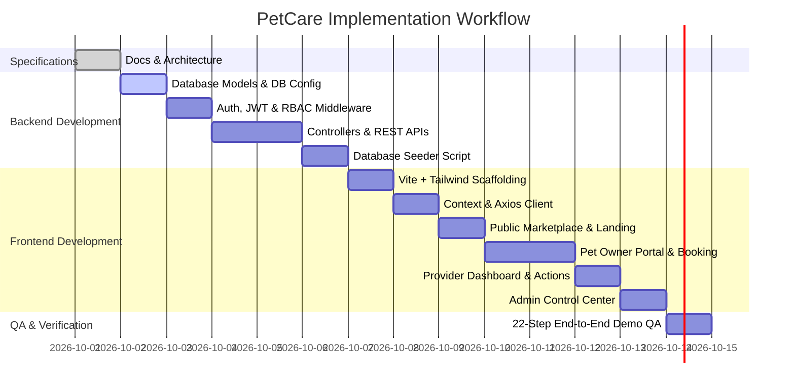

# PetCare - Step-by-Step Implementation Roadmap

This document outlines the systematic, phased implementation plan for developing the **PetCare Management Platform**.

---

## 📅 Phase-by-Phase Execution Plan

---

### Phase 1: Environment & Repository Scaffolding
- [x] Create project documentation (.md files).
- [ ] Initialize `/server` directory with `package.json` (`express`, `mongoose`, `jsonwebtoken`, `bcryptjs`, `cors`, `dotenv`, `morgan`).
- [ ] Initialize `/client` directory with Vite React template (`react`, `react-dom`, `react-router-dom`, `axios`, `lucide-react`, `tailwindcss`, `postcss`, `autoprefixer`).
- [ ] Configure `server/.env.example` and root `.gitignore`.

### Phase 2: Database Layer & Data Modeling
- [ ] Configure MongoDB connection utility in `server/config/db.js`.
- [ ] Implement `server/models/User.js` (with bcrypt pre-save password hash and compare method).
- [ ] Implement `server/models/Pet.js` (with species enum and positive weight check).
- [ ] Implement `server/models/ProviderProfile.js` (with providerType enum, approval status, and compound indexes).
- [ ] Implement `server/models/Service.js` (with provider foreign key, price, and duration).
- [ ] Implement `server/models/Appointment.js` (with compound index for collision check).
- [ ] Implement `server/models/Notification.js` (with 30-day TTL expiry).

### Phase 3: Authentication & Security Middleware
- [ ] Build JWT signing utility in `server/utils/generateToken.js`.
- [ ] Build `server/middleware/authMiddleware.js` (token extraction, validation, attaching `req.user`).
- [ ] Build `server/middleware/roleMiddleware.js` (role access enforcement).
- [ ] Build `server/middleware/errorMiddleware.js` (centralized error format, Mongoose error parsing).
- [ ] Create standardized JSON response helper in `server/utils/apiResponse.js`.

### Phase 4: Backend REST Controllers & Endpoints
- [ ] Implement `authController.js` and `authRoutes.js` (register, login, me, profile, change-password).
- [ ] Implement `petController.js` and `petRoutes.js` (CRUD with user ownership validation).
- [ ] Implement `providerController.js` and `providerRoutes.js` (public marketplace listing, filtering, me profile).
- [ ] Implement `serviceController.js` and `serviceRoutes.js` (provider service catalog CRUD).
- [ ] Implement `appointmentController.js` and `appointmentRoutes.js` (server-side price lock, collision prevention, past date check, status transitions).
- [ ] Implement `notificationController.js` and `notificationRoutes.js` (fetch, mark single read, mark all read).
- [ ] Implement `adminController.js` and `adminRoutes.js` (metrics dashboard, provider approve/reject/suspend, user status toggle, all appointments).

### Phase 5: Automated Seeder & Mock Dataset
- [ ] Construct `server/seed/seedData.js` with demo admin, 2 pet owners, 6 providers, 18+ services, 4 pets, and test appointments.
- [ ] Implement `server/seed/seeder.js` (`npm run seed`) to clear and cleanly repopulate collections.

### Phase 6: Frontend Setup & Tailwind Design System
- [ ] Configure `tailwind.config.js` with primary emerald, secondary amber, and neutral slate color schemes.
- [ ] Write `client/src/index.css` with custom utility styles, scrollbar aesthetics, and button components.
- [ ] Create core UI atoms: `Navbar.jsx`, `Footer.jsx`, `Button.jsx`, `Badge.jsx`, `Modal.jsx`, `Loader.jsx`, `Toast.jsx`.

### Phase 7: State Management & Axios HTTP Client
- [ ] Configure Axios client in `client/src/services/api.js` with Bearer token injection and 401 redirect handling.
- [ ] Implement `AuthContext.jsx` with persistent user session (`localStorage`), login, register, and logout functions.
- [ ] Implement `NotificationContext.jsx` for periodic notification polling and unread indicator badge.
- [ ] Configure `ProtectedRoute.jsx` and `RoleRoute.jsx` route guards.

### Phase 8: Public Views & Marketplace UI
- [ ] Build `HomePage.jsx` (Hero, Search bar, Popular categories, How It Works, Featured providers, CTA, Footer).
- [ ] Build `AboutPage.jsx` and `ServicesPage.jsx`.
- [ ] Build `MarketplacePage.jsx` with real-time text search, type filters (Vet/Groomer/Trainer), and location filter.
- [ ] Build `ProviderProfilePage.jsx` displaying qualifications, bio, and service catalog cards.
- [ ] Build `LoginPage.jsx`, `RegisterOwnerPage.jsx`, and `RegisterProviderPage.jsx`.

### Phase 9: Pet Owner Experience & Booking Engine
- [ ] Build `OwnerDashboard.jsx` (metric counters, upcoming appointments list, quick links).
- [ ] Build `MyPetsPage.jsx` (pet cards, add pet modal, edit pet modal, delete confirmation).
- [ ] Build `BookAppointmentModal.jsx` (service selector, pet selector, date picker, collision-free slot grid, reason input, locked price display).
- [ ] Build `MyAppointmentsPage.jsx` with tabs (`Upcoming`, `Completed`, `Cancelled`) and cancel booking action.

### Phase 10: Service Provider Experience
- [ ] Build `ProviderDashboard.jsx` (total, pending, upcoming, completed statistics).
- [ ] Build `MyServicesPage.jsx` (service catalog cards, add service modal, edit service modal, delete service).
- [ ] Build `ProviderAppointmentsPage.jsx` with status action buttons (**Accept / Confirm**, **Reject**, **Mark Completed**).
- [ ] Build `ProviderProfileEditPage.jsx`.

### Phase 11: Admin Control Center
- [ ] Build `AdminDashboard.jsx` with platform summary stat cards.
- [ ] Build `ProviderApprovalPage.jsx` with approval queues, credentials review, and Approve / Reject / Suspend actions.
- [ ] Build `UserManagementPage.jsx` with user table, role filters, and active/inactive toggles.
- [ ] Build `AllAppointmentsPage.jsx` with platform audit filters.

### Phase 12: Quality Assurance, Verification & Demo Run
- [ ] Execute the 22-step demonstration script from `docs/SEED_DATA_AND_DEMO_GUIDE.md`.
- [ ] Validate responsive behavior across Mobile (375px), Tablet (768px), and Desktop (1280px).
- [ ] Finalize code cleanup, remove console logs, and verify build (`npm run build`).
