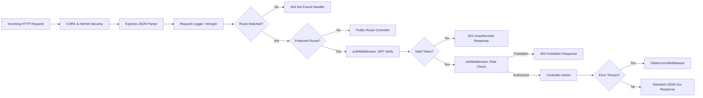

# PetCare - System Architecture Documentation

This document outlines the software architecture, design patterns, directory hierarchies, and component interaction models for the **PetCare Management Platform**.

---

## 1. High-Level Architectural Pattern

PetCare adheres to the **3-Tier Client-Server Architecture**:

```text
┌──────────────────────────────────────────────────────────────────┐
│                   PRESENTATION TIER (CLIENT)                     │
│  React.js (SPA) • Vite • Tailwind CSS • React Router • Axios     │
└─────────────────────────────────┬────────────────────────────────┘
                                  │ HTTPS / JSON REST
                                  ▼
┌──────────────────────────────────────────────────────────────────┐
│                    APPLICATION TIER (SERVER)                     │
│  Node.js • Express.js • JWT RBAC Middleware • Controllers        │
└─────────────────────────────────┬────────────────────────────────┘
                                  │ Mongoose ODM / BSON
                                  ▼
┌──────────────────────────────────────────────────────────────────┐
│                     DATA TIER (PERSISTENCE)                      │
│                MongoDB Document-Based Database                   │
└──────────────────────────────────────────────────────────────────┘
```

---

## 2. Server Architecture & Modular Directory Structure

The backend follows the **Controller-Service-Model** pattern, cleanly decoupling HTTP routing, request validation, business logic, and database operations.

```text
server/
├── config/
│   └── db.js                 # MongoDB connection logic with Mongoose
├── controllers/              # Handles HTTP request/response orchestration
│   ├── authController.js     # Register, login, profile, password change
│   ├── petController.js      # Pet CRUD and ownership verification
│   ├── providerController.js # Provider marketplace query, profile updates
│   ├── serviceController.js  # Service catalog CRUD
│   ├── appointmentController.js # Booking logic, price lock, status workflow
│   ├── notificationController.js # In-app notification retrieval & read status
│   └── adminController.js    # Platform metrics, provider approvals, moderation
├── middleware/               # Reusable request processing pipeline
│   ├── authMiddleware.js     # Validates JWT bearer tokens & attaches req.user
│   ├── roleMiddleware.js     # Role verification (PET_OWNER, SERVICE_PROVIDER, ADMIN)
│   ├── errorMiddleware.js    # Global error handler and 404 handler
│   └── validateMiddleware.js # Sanitization & schema validation helpers
├── models/                   # Mongoose schemas & data contracts
│   ├── User.js
│   ├── Pet.js
│   ├── ProviderProfile.js
│   ├── Service.js
│   ├── Appointment.js
│   └── Notification.js
├── routes/                   # REST endpoint route mappings
│   ├── authRoutes.js
│   ├── petRoutes.js
│   ├── providerRoutes.js
│   ├── serviceRoutes.js
│   ├── appointmentRoutes.js
│   ├── notificationRoutes.js
│   └── adminRoutes.js
├── seed/                     # Database seeder scripts for fast demo
│   ├── seedData.js           # Static mock fixtures
│   └── seeder.js             # Seeder execution script
├── utils/                    # Shared utility functions
│   ├── generateToken.js      # JWT signing utility
│   ├── apiResponse.js        # Standardized JSON response helper
│   └── dateHelpers.js        # Time slot and date validation routines
├── .env.example              # Environment variables template
├── package.json              # Backend dependencies and scripts
└── server.js                 # Main application entrypoint
```

---

## 3. Express Middleware Pipeline

Requests flow through a deterministic middleware pipeline before reaching the target controller:



### Key Middleware Definitions
1. **`authMiddleware`**:
   - Extracts the Bearer token from the `Authorization` header.
   - Verifies the signature against `JWT_SECRET`.
   - Fetches the active user from MongoDB (excluding password hash) and binds it to `req.user`.
   - Rejects the request if the user is suspended (`isActive === false`).
2. **`roleMiddleware(allowedRoles)`**:
   - Takes a list of permitted roles (e.g., `['ADMIN']`, `['SERVICE_PROVIDER']`, `['PET_OWNER']`).
   - Ensures `allowedRoles.includes(req.user.role)`.
3. **`errorMiddleware`**:
   - Intercepts all unhandled errors passed via `next(err)`.
   - Maps Mongoose validation errors, CastErrors, and duplicate key errors (code 11000) into clear user-friendly messages.
   - Ensures internal stack traces are suppressed in production.

---

## 4. Client Architecture & Modular Directory Structure

The frontend is a modern React 18 Single Page Application built on Vite and styled with Tailwind CSS:

```text
client/
├── public/                   # Static assets, SVG icons, favicon
├── src/
│   ├── assets/               # Local images and graphic illustrations
│   ├── components/           # Reusable UI building blocks
│   │   ├── common/           # Atoms & molecules
│   │   │   ├── Navbar.jsx    # Responsive navigation bar with role awareness
│   │   │   ├── Footer.jsx    # Footer with quick links and branding
│   │   │   ├── Button.jsx    # Styled buttons (primary, outline, danger)
│   │   │   ├── Modal.jsx     # Accessible dialog wrapper
│   │   │   ├── Badge.jsx     # Color-coded status badges
│   │   │   ├── Loader.jsx    # Loading spinner and skeleton placeholders
│   │   │   └── Toast.jsx     # Alert messages and toast alerts
│   │   ├── cards/            # Domain-specific composite cards
│   │   │   ├── ProviderCard.jsx # Marketplace provider showcase card
│   │   │   ├── ServiceCard.jsx  # Service listing card with price tag
│   │   │   ├── PetCard.jsx      # Pet summary card with photo and stats
│   │   │   └── StatCard.jsx     # Metrics card for dashboard overviews
│   │   └── forms/            # Form controls
│   │       ├── Input.jsx
│   │       ├── Select.jsx
│   │       └── SearchBar.jsx
│   ├── context/              # Global React state providers
│   │   ├── AuthContext.jsx   # Authentication state, login, logout, user profile
│   │   └── NotificationContext.jsx # Notification polling, unread count badge
│   ├── hooks/                # Custom React hooks
│   │   ├── useAuth.js        # Easy access to AuthContext
│   │   ├── useNotifications.js # Easy access to notifications
│   │   └── useDebounce.js    # Debouncing search input queries
│   ├── layouts/              # Structural wrappers for different route types
│   │   ├── MainLayout.jsx    # Public & landing layout (Navbar + Content + Footer)
│   │   ├── DashboardLayout.jsx # Owner & Provider layout (Sidebar + Header + Body)
│   │   └── AdminLayout.jsx   # Administrator control center layout
│   ├── pages/                # Screen views mapped to URLs
│   │   ├── public/
│   │   │   ├── HomePage.jsx
│   │   │   ├── AboutPage.jsx
│   │   │   ├── ServicesPage.jsx
│   │   │   ├── MarketplacePage.jsx
│   │   │   └── ProviderProfilePage.jsx
│   │   ├── auth/
│   │   │   ├── LoginPage.jsx
│   │   │   ├── RegisterOwnerPage.jsx
│   │   │   └── RegisterProviderPage.jsx
│   │   ├── owner/
│   │   │   ├── OwnerDashboard.jsx
│   │   │   ├── MyPetsPage.jsx
│   │   │   ├── PetDetailPage.jsx
│   │   │   ├── BookAppointmentPage.jsx
│   │   │   └── MyAppointmentsPage.jsx
│   │   ├── provider/
│   │   │   ├── ProviderDashboard.jsx
│   │   │   ├── MyServicesPage.jsx
│   │   │   ├── ProviderAppointmentsPage.jsx
│   │   │   └── ProviderProfileEditPage.jsx
│   │   └── admin/
│   │       ├── AdminDashboard.jsx
│   │       ├── UserManagementPage.jsx
│   │       ├── ProviderApprovalPage.jsx
│   │       └── AllAppointmentsPage.jsx
│   ├── routes/               # Route guard components
│   │   ├── ProtectedRoute.jsx # Checks authenticated state
│   │   └── RoleRoute.jsx      # Checks user role authorization
│   ├── services/             # HTTP API modules using Axios
│   │   ├── api.js            # Axios instance with interceptors
│   │   ├── authService.js
│   │   ├── petService.js
│   │   ├── providerService.js
│   │   ├── appointmentService.js
│   │   └── adminService.js
│   ├── utils/                # Helper functions (dates, currencies, status helpers)
│   ├── App.jsx               # Top-level React Router configuration
│   ├── index.css             # Tailwind CSS entrypoint
│   └── main.jsx              # React DOM render entrypoint
├── index.html
├── tailwind.config.js
└── vite.config.js
```

---

## 4. Frontend Routing & Navigation Guard Architecture

PetCare enforces role-based navigation guards using React Router v6:

```text
/ (Public) ──> HomePage
├── /about ──> AboutPage
├── /services ──> ServicesPage
├── /marketplace ──> MarketplacePage (Browse approved providers)
├── /providers/:id ──> ProviderProfilePage
├── /login ──> LoginPage
├── /register ──> RegisterOwnerPage
└── /register/provider ──> RegisterProviderPage

/owner/* (Guarded by ProtectedRoute + RoleRoute['PET_OWNER'])
├── /owner/dashboard ──> OwnerDashboard
├── /owner/pets ──> MyPetsPage
├── /owner/pets/add ──> PetFormPage
├── /owner/pets/:id ──> PetDetailPage
├── /owner/book/:providerId ──> BookAppointmentPage
├── /owner/appointments ──> MyAppointmentsPage
└── /owner/profile ──> ProfilePage

/provider/* (Guarded by ProtectedRoute + RoleRoute['SERVICE_PROVIDER'])
├── /provider/dashboard ──> ProviderDashboard
├── /provider/services ──> MyServicesPage
├── /provider/appointments ──> ProviderAppointmentsPage
└── /provider/profile ──> ProviderProfileEditPage

/admin/* (Guarded by ProtectedRoute + RoleRoute['ADMIN'])
├── /admin/dashboard ──> AdminDashboard
├── /admin/users ──> UserManagementPage
├── /admin/providers ──> ProviderApprovalPage
├── /admin/appointments ──> AllAppointmentsPage
└── /admin/pets ──> AllPetsPage
```

---

## 5. Centralized Axios API Layer & Interceptors

The client communicates with the backend via a centralized Axios instance configured with request and response interceptors:

```javascript
// Request Interceptor: Injects Authorization Header
api.interceptors.request.use((config) => {
  const token = localStorage.getItem('petcare_token');
  if (token) {
    config.headers.Authorization = `Bearer ${token}`;
  }
  return config;
});

// Response Interceptor: Handles Token Expiration Gracefully
api.interceptors.response.use(
  (response) => response.data,
  (error) => {
    if (error.response && error.response.status === 401) {
      localStorage.removeItem('petcare_token');
      localStorage.removeItem('petcare_user');
      window.location.href = '/login?sessionExpired=true';
    }
    return Promise.reject(error.response ? error.response.data : error);
  }
);
```

---

## 6. Standardized API Response Contracts

To maintain predictable communication between server and client, every REST endpoint yields a uniform response structure:

### Successful Response:
```json
{
  "success": true,
  "message": "Operation completed successfully",
  "data": {}
}
```

### Error Response:
```json
{
  "success": false,
  "message": "Descriptive error message explaining the failure",
  "errors": []
}
```
